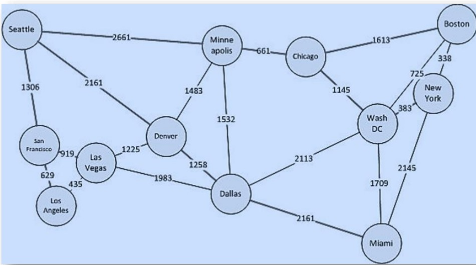

GraphQL
============================================================================

## What is Graph?
A graph is a data structure that is defined by two components: 

1. A node or a vertex. 
2. An edge E or ordered pair is a connection between two nodes u,v that is defined by unique pair(u,v). 


Graph Example: Distance between countries

---

# Loopholes in traditional architectures
## 1. Understanding REST: Representional State Transfer </br>
It it a software architecture that defines a set of constraints to be used for creating web services.


## 2. Underfetching and the n+1 problem
Another issue is underfetching and the n+1-requests problem. Underfetching generally means that a specific endpoint doesn’t provide enough of the required information. The client will have to make additional requests to fetch everything it needs. This can escalate to a situation where a client needs to first download a list of elements, but then needs to make one additional request per element to fetch the required data.

As an example, consider the same app would also need to display the last three followers per user. The API provides the additional endpoint `/users/<user-id>/followers`. In order to be able to display the required information, the app will have to make one request to the `/users` endpoint and then hit the `/users/<user-id>/followers` endpoint for each user.

## 3. Overfetching: Downloading superfluous data
Overfetching means that a client downloads more information than is actually required in the app. Imagine for example a screen that needs to display a list of users only with their names. In a REST API, this app would usually hit the `/users` endpoint and receive a JSON array with user data. This response however might contain more info about the users that are returned, e.g. their birthdays or addresses - information that is useless for the client because it only needs to display the users’ names.

## 4. Structure of the response
REST won't provide any standard structure of schema information. It might change between developers. For example, some of the endpoints might have `firstName` and `lastName` while others might have `fName` and `lName`.

---

# What is GraphQL?
GraphQL is a new API standard that provides a more efficient, powerful and flexible alternative to REST. It was developed and open-sourced by Facebook and is now maintained by a large community of companies and individuals from all over the world.


# Core Concepts

## 1. Schema Definition Language
GraphQL has its own type system that’s used to define the schema of an API. The syntax for writing schemas is called Schema Definition Language (SDL).

Here is an example how we can use the SDL to define a simple type called Person:
```graphql
type Person {
  name: String!
  age: Int!
}

type Post {
  title: String!
  author: Person!
}

type Person {
  name: String!
  age: Int!
  posts: [Post!]!
}
```

## 2. Fetching Data with Queries
### Basic Query
```graphql
{
  allPersons {
    name
  }
}
```
```json
{
  "allPersons": [
    { "name": "Johnny" },
    { "name": "Sarah" },
    { "name": "Alice" }
  ]
}
```

### Customised
```graphql
{
  allPersons {
    name
    age
    posts {
      title
    }
  }
}
```

### Queries with Arguments
```graphql
{
  allPersons(last: 2) {
    name
  }
}
```

### Writing Data with Mutations
There generally are three kinds of mutations:
- Creating new data
- Updating existing data
- Deleting existing data

```graphql
mutation {
  createPerson(name: "Bob", age: 36) {
    name
    age
  }
}
```
```json
"createPerson": {
  "name": "Bob",
  "age": 36,
}
```

### Realtime Updates with Subscriptions
```graphql
subscription {
  newPerson {
    name
    age
  }
}
```
```json
{
  "newPerson": {
    "name": "Jane",
    "age": 23
  }
}
```

### Defining a Schema
```graphql
type Query { ... }
type Mutation { ... }
type Subscription { ... }
```

```graphql
type Query {
  allPersons(last: Int): [Person!]!
}

type Mutation {
  createPerson(name: String!, age: Int!): Person!
}

type Subscription {
  newPerson: Person!
}

type Person {
  name: String!
  age: Int!
  posts: [Post!]!
}

type Post {
  title: String!
  author: Person!
}
```

---

# References:
1. [Why Should We Choose REST (Client-Server) Model to Develop Web Apps ?](https://medium.com/@audira98/why-should-we-choose-rest-client-server-model-to-develop-web-apps-c3bb2451b13a) </br>

2. [GraphQL is the better REST](https://www.howtographql.com/basics/1-graphql-is-the-better-rest/) <br/>


